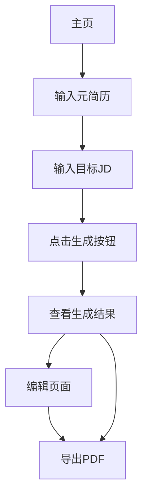

# 智能简历优化助手产品需求文档

## 1. 产品概述

智能简历优化助手是一款AI驱动的Web应用，帮助求职者基于不同岗位描述(JD)快速定制专属简历。用户只需提供元简历和目标JD，系统将自动分析匹配度并生成优化的简历，解决求职者"一份简历投所有"的低效问题。

* 核心价值：让每位求职者都能轻松、高效地为心仪岗位定制最具竞争力的专属简历

* 目标用户：有2-5年工作经验的互联网从业者，正处于积极求职阶段

* 产品定位：快速验证核心价值的MVP产品，专注简历智能优化功能

## 2. 核心功能

### 2.1 用户角色

本产品为单一用户角色设计，无需复杂的权限管理：

| 角色  | 注册方式      | 核心权限                              |
| --- | --------- | --------------------------------- |
| 求职者 | 无需注册，直接使用 | 可使用所有核心功能：输入简历和JD、生成优化简历、编辑和导出PDF |

### 2.2 功能模块

我们的智能简历优化助手包含以下核心页面：

1. **主页**：元简历输入区、JD输入区、生成按钮、结果展示区
2. **编辑页面**：富文本编辑器、实时预览、导出功能

### 2.3 页面详情

| 页面名称 | 模块名称    | 功能描述                                    |
| ---- | ------- | --------------------------------------- |
| 主页   | 元简历输入模块 | 提供大文本输入框，支持最多20000字符的简历内容粘贴，显示字符计数和输入提示 |
| 主页   | JD输入模块  | 提供文本输入框用于粘贴目标岗位JD，支持大段文本输入和格式识别         |
| 主页   | 智能生成引擎  | 点击生成按钮后，AI分析JD关键词，匹配简历内容，重组优化并生成专属简历草稿  |
| 主页   | 结果展示区   | 显示生成的简历预览，提供编辑入口和快速导出选项                 |
| 编辑页面 | 富文本编辑器  | 所见即所得的编辑界面，支持文本格式调整、内容修改和实时保存           |
| 编辑页面 | PDF导出模块 | 一键生成排版简洁的PDF文件并触发下载，使用统一的简历模板           |

## 3. 核心流程

用户操作流程如下：

1. **进入主页** - 用户访问网站，看到三个核心区域：元简历输入、JD输入、结果展示
2. **输入元简历** - 在左侧输入框粘贴完整的个人简历内容
3. **输入目标JD** - 在中间输入框粘贴目标岗位的职位描述
4. **智能生成** - 点击生成按钮，系统分析匹配度并生成优化简历
5. **编辑优化** - 在结果区域查看生成的简历，可进入编辑页面进行微调
6. **导出使用** - 点击导出PDF按钮，下载最终简历文件用于投递

## 4. 用户界面设计

### 4.1 设计风格

* **主色调**：专业蓝色(#2563eb)和深灰色(#374151)

* **辅助色**：浅灰色背景(#f9fafb)和成功绿色(#10b981)

* **按钮风格**：圆角矩形，渐变效果，悬停状态变化

* **字体**：系统默认字体栈，标题16-20px，正文14px

* **布局风格**：卡片式设计，左中右三栏布局，响应式适配

* **图标风格**：使用简洁的线性图标，统一风格，避免emoji

### 4.2 页面设计概览

| 页面名称 | 模块名称    | UI元素                                            |
| ---- | ------- | ----------------------------------------------- |
| 主页   | 元简历输入模块 | 大型文本域，占屏幕左侧1/3，白色背景，圆角边框，字符计数显示，placeholder提示文字 |
| 主页   | JD输入模块  | 中等文本域，占屏幕中间1/3，与元简历输入框样式一致，专门的JD输入提示            |
| 主页   | 生成按钮    | 居中放置的主要按钮，蓝色渐变背景，白色文字，悬停效果，loading状态显示          |
| 主页   | 结果展示区   | 占屏幕右侧1/3，卡片式布局，生成的简历预览，编辑和导出按钮                  |
| 编辑页面 | 富文本编辑器  | 全屏编辑界面，工具栏包含基本格式选项，实时预览功能                       |
| 编辑页面 | 导出模块    | 固定在页面顶部的操作栏，包含保存、预览、导出PDF按钮                     |

### 4.3 响应式设计

产品采用桌面优先设计，同时适配移动端：

* 桌面端：三栏并排布局，充分利用屏幕宽度

* 平板端：调整为上下布局，保持功能完整性

* 移动端：单栏垂直布局，优化触摸交互体验

