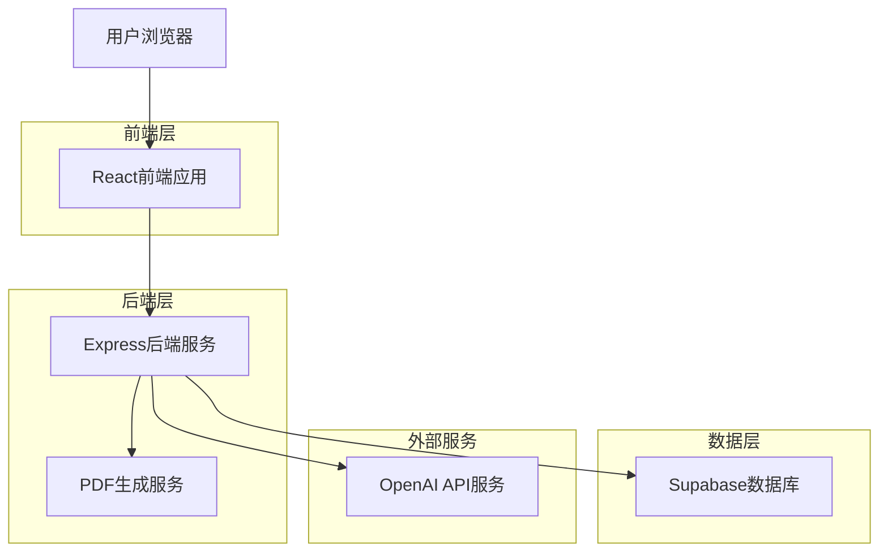
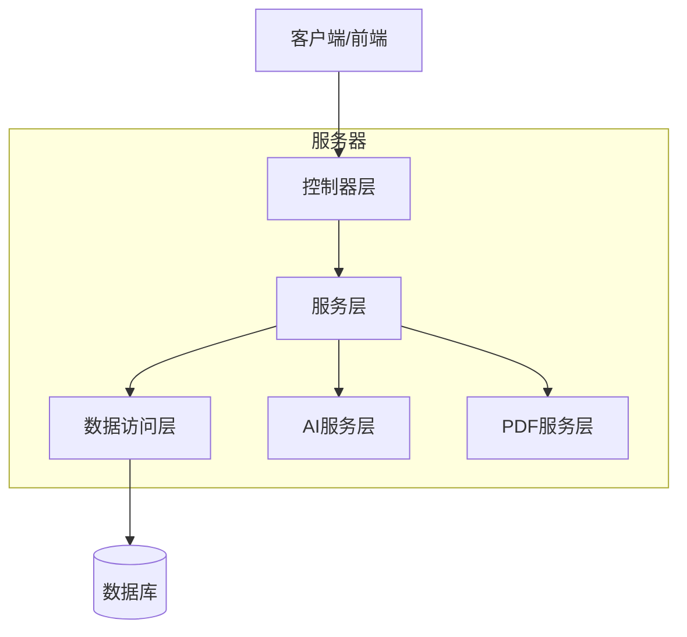
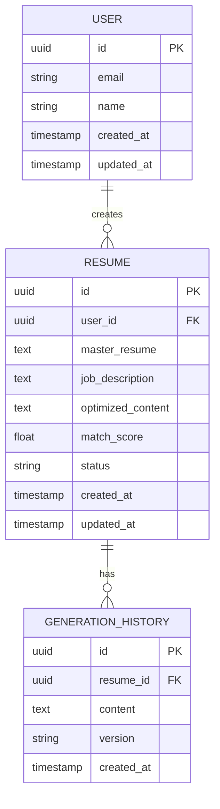

# 智能简历优化助手技术架构文档

## 1. 架构设计



## 2. 技术描述

* 前端：React\@18 + TypeScript + Tailwind CSS + Vite

* 后端：Express\@4 + TypeScript + Node.js

* 数据库：Supabase (PostgreSQL)

* AI服务：OpenAI GPT API

* PDF生成：Puppeteer

* 富文本编辑：React-Quill

## 3. 路由定义

| 路由           | 用途                  |
| ------------ | ------------------- |
| /            | 主页，包含简历输入、JD输入和生成功能 |
| /edit/:id    | 编辑页面，富文本编辑生成的简历     |
| /preview/:id | 预览页面，查看最终简历效果       |

## 4. API定义

### 4.1 核心API

简历生成相关

```
POST /api/resume/generate
```

请求：

| 参数名称           | 参数类型   | 是否必需  | 描述       |
| -------------- | ------ | ----- | -------- |
| masterResume   | string | true  | 用户的元简历内容 |
| jobDescription | string | true  | 目标岗位JD内容 |
| userId         | string | false | 用户标识（可选） |

响应：

| 参数名称            | 参数类型    | 描述       |
| --------------- | ------- | -------- |
| success         | boolean | 请求是否成功   |
| data            | object  | 生成的简历数据  |
| data.id         | string  | 简历唯一标识   |
| data.content    | string  | 优化后的简历内容 |
| data.matchScore | number  | 匹配度评分    |

示例：

```json
{
  "masterResume": "张三，软件工程师，5年开发经验...",
  "jobDescription": "招聘高级前端工程师，要求React、TypeScript经验..."
}
```

简历编辑相关

```
PUT /api/resume/:id
```

请求：

| 参数名称    | 参数类型   | 是否必需 | 描述       |
| ------- | ------ | ---- | -------- |
| content | string | true | 编辑后的简历内容 |

响应：

| 参数名称    | 参数类型    | 描述       |
| ------- | ------- | -------- |
| success | boolean | 更新是否成功   |
| data    | object  | 更新后的简历数据 |

PDF导出相关

```
POST /api/resume/:id/export
```

请求：

| 参数名称   | 参数类型   | 是否必需  | 描述         |
| ------ | ------ | ----- | ---------- |
| format | string | false | 导出格式，默认PDF |

响应：

| 参数名称        | 参数类型    | 描述        |
| ----------- | ------- | --------- |
| success     | boolean | 导出是否成功    |
| downloadUrl | string  | PDF文件下载链接 |

## 5. 服务器架构图



## 6. 数据模型

### 6.1 数据模型定义



### 6.2 数据定义语言

用户表 (users)

```sql
-- 创建用户表
CREATE TABLE users (
    id UUID PRIMARY KEY DEFAULT gen_random_uuid(),
    email VARCHAR(255) UNIQUE,
    name VARCHAR(100),
    created_at TIMESTAMP WITH TIME ZONE DEFAULT NOW(),
    updated_at TIMESTAMP WITH TIME ZONE DEFAULT NOW()
);

-- 创建索引
CREATE INDEX idx_users_email ON users(email);
```

简历表 (resumes)

```sql
-- 创建简历表
CREATE TABLE resumes (
    id UUID PRIMARY KEY DEFAULT gen_random_uuid(),
    user_id UUID REFERENCES users(id),
    master_resume TEXT NOT NULL,
    job_description TEXT NOT NULL,
    optimized_content TEXT,
    match_score FLOAT DEFAULT 0,
    status VARCHAR(20) DEFAULT 'draft' CHECK (status IN ('draft', 'completed', 'exported')),
    created_at TIMESTAMP WITH TIME ZONE DEFAULT NOW(),
    updated_at TIMESTAMP WITH TIME ZONE DEFAULT NOW()
);

-- 创建索引
CREATE INDEX idx_resumes_user_id ON resumes(user_id);
CREATE INDEX idx_resumes_created_at ON resumes(created_at DESC);
CREATE INDEX idx_resumes_status ON resumes(status);
```

生成历史表 (generation\_history)

```sql
-- 创建生成历史表
CREATE TABLE generation_history (
    id UUID PRIMARY KEY DEFAULT gen_random_uuid(),
    resume_id UUID REFERENCES resumes(id) ON DELETE CASCADE,
    content TEXT NOT NULL,
    version VARCHAR(10) DEFAULT '1.0',
    created_at TIMESTAMP WITH TIME ZONE DEFAULT NOW()
);

-- 创建索引
CREATE INDEX idx_generation_history_resume_id ON generation_history(resume_id);
CREATE INDEX idx_generation_history_created_at ON generation_history(created_at DESC);

-- 设置权限
GRANT SELECT ON resumes TO anon;
GRANT ALL PRIVILEGES ON resumes TO authenticated;
GRANT ALL PRIVILEGES ON generation_history TO authenticated;

-- 初始化数据（可选）
INSERT INTO resumes (master_resume, job_description, optimized_content, match_score, status)
VALUES 
('示例元简历内容...', '示例JD内容...', '示例优化后简历...', 0.85, 'completed');
```

